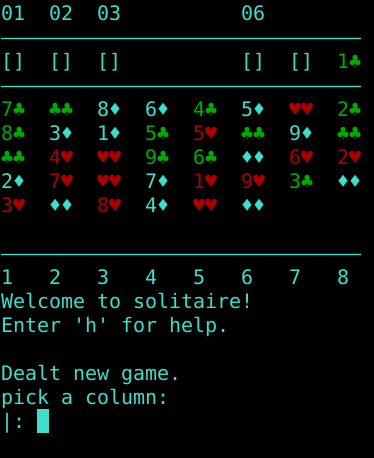

# Solitaire_pl

A solitaire type card game with rules similar to [shenzhen solitaire](https://zachtronics.itch.io/shenzhen-solitaire). Plays in a terminal, with Unicode "cards"; is written in prolog; has an undo feature. Type "h" in game for help.

## Requirements

Uses the [swipl](https://www.swi-prolog.org/download/stable) prolog implementation.

## Installation

Run the included build script:

    build.sh
    
## Playing

Run the `solitaire` executable:

    ./solitaire

Type "h" for help, "q" to quit. The rules of the game are also explained in the help message. Essentially, the cards must be stacked with alternating colors; once a card with number `1` is at the bottom of a column, it will automatically go to the top right; finally the special "family" cards $$\color{green}♣♣$$, $$\color{green}♥♥$$ and ♦♦ must have all four copies at the bottom of different columns to "reunite" in one of the top left one. (This last move requires one of the four copies to already be in one of the top left columns numbered `01`, `02` or `03`).

The game current game is saved after every move. Additionally, some statistics are saved after every game: win, loss, undos and restart numbers and ratios, as well as win streak and max streak.
